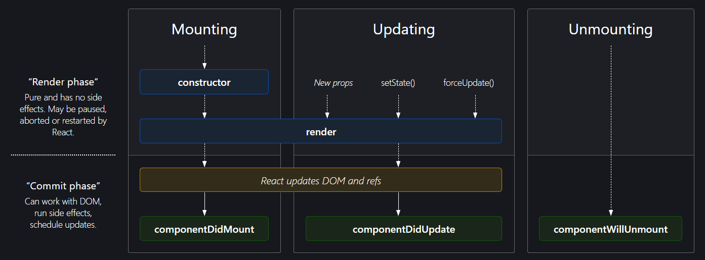
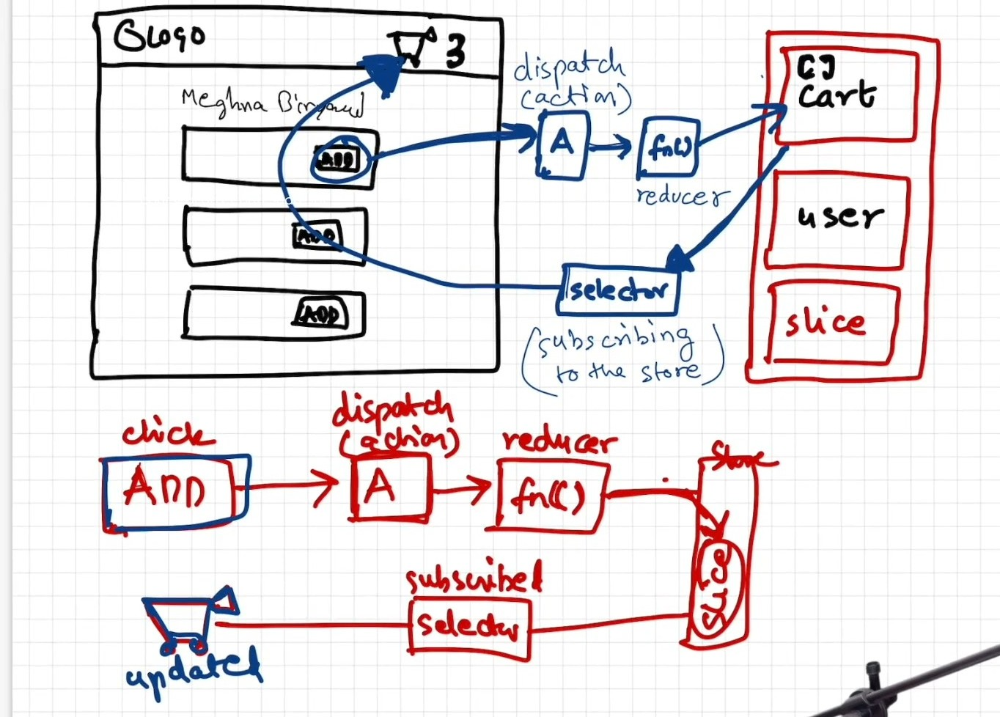

# Namaste React 🚀

## Parcel

    -> Zero Config - just install it and start using it (no need to do any configuration for it)
    -> created Development build of our app
    -> created a server with port no: 1234
    -> hosted our development build on to the server i.e. localhost:1234
    -> It does HMR (Hot Module Replacement) in all the files in our project
        - Parcel is using HMR means whenever, whatever and whereever we make any changes and as soon as we save that file it builts it once again and hosts the new development build on to the server (localhost:1234).
    -> Parcel does HMR because it is monitoring (keeping an eye) all the files and for that it uses 'File Watching Algorithm' which is written in C++
    -> parcel is taking so less time in building those updated development builds because it is also doing caching in '.parcel-cache' to give us faster development experience
    -> Image Optimization
    -> Minification - Instead of development build if we do production build parcel will also do minification of our files as well.
    -> Bundling of our files
    -> It compresses our files also..
    -> Consistent Hashing
    -> Code Splitting
    -> Differential Bundling - Our app can open in Internet Explorer (newer & older), Chrome, Mobile Browser, FireFox etc ... Parcel takes care of all that and gives differential bundling to our app so that our apps runs on both older & newer versions of the browsers .... basically it gives us ability to have different bundles for different types of older browsers.
    -> Diagnostic - If you make an error in your code and configuration , Parcel displays beautiful diagnostics in your terminal and in the browser.
    -> currently our app is hosted on http but it gives us the ability to run our app on https as well (if we want to check any feature of our app is running on the https as well or not)
    -> Tree Shaking - Parcel statically analyzes the imports and exports of each module, and removes everythjing that isn't used.
    -> Parcel creates different development build and production build bundles (because production build takes a little more time than develoment builds because some optimizations are more in production build than than deveelopment build)

## Accessing one component inside another component

-> We can do like putting the component name in other component like -- <Componentname/>
but we can also do it like -- <Componentname></Componentname>
because <Componentname/> is the short hand way (shortcut) of <Componentname></Componentname> , so they both are same.

## Two types of Export & Import

    -> Default Export/Import
        export default Component/variable;
        import Component/variable from "path";

    -> Named Export/Import
        export const Component/variable;
        import {Component/variable} from "path";

## React Hooks

-> Normal JS utility functions
-> Two important and commonly used hooks are-
-> useState() : used to create State variables in React.
-> usseEffect() :

-> State Variable keeps the UI in sync with the data layer (whatever the data will be, it will be rendered on the UI but if the Data layer changes UI will also get re-rendered based the changed data layer)

## How the state variable declared using const can be changed using the setState()?

    => The value of a state variable declared using const can be changed because React internally manages the state. The const declaration means the reference to the variable name (count, name, etc.) doesn’t change — not the value itself.

        When setState() is called, React updates the internal state value and then re-renders the component. During this re-render, React calls the function component again, and the state variable (const) now refers to the updated value.

            So, even though we use const, the value appears to change because React provides a new value in the next render, not by replacing the variable, but by re-invoking the function with updated internal state.

                                                    OR

    => The value of a state variable declared using const can be changed because React internally manages the state. The const declaration means that the reference to the state variable name (like count, user, etc.) doesn’t change — but the value it holds can during re-renders.

        When setState() is called:

            - "React updates the internal state value."

            - "React then triggers a re-render of the component."

            - "During the re-render, React calls the function component again, and the const state variable now refers to the updated value."

            Behind the scenes, React uses a virtual DOM diffing algorithm to detect which parts of the UI have changed.

            - "It doesn't re-render the entire DOM."

            - "It only updates the parts that are different, making it highly efficient."

            - "So although the component function is re-executed, React intelligently updates only the affected DOM elements based on the updated state."

    In short, even though we use const, it works because React provides a new value during each re-render, and ensures that only the necessary parts of the UI are updated, not the whole page.

## 2 types of routing in web app

    1) Client Side Routing - Here we don't make any network calls (while navigating b/w pages) for pages (like index.html,about.html,etc) or any kind of Components instead at the initial render/loading of the web page (in-case of React) all the components gets loaded they just re-render o0r replace the other components while we navigate b/w pages.

    2) Server Side Routing - Here to navgate b/w pages we need to make network call to the server for those pages we are navigating to  from the server like index.html,about.html, etc.

## React Lifecycle Methods Diagram

-> https://projects.wojtekmaj.pl/react-lifecycle-methods-diagram/

## Advantages & Dusadvantages of Tailwind CSS

### ✅ Advantages of Tailwind CSS

    **1. Utility-First Approach**
    Tailwind uses utility classes like p-4, m-2, text-center, etc., which makes styling fast, consistent, and predictable.

    **2. Lightweight and Optimized**
    Tailwind is highly optimized during the build process using PurgeCSS, which removes all unused classes.
    🔹 Example: Even if you use a class like m-4 or p-4 a thousand times across your project, it is included only once in the final CSS bundle, keeping the file size minimal.

    **3. Tiny Final CSS Bundle**
    Tailwind ensures that you never ship unused CSS again.
    In traditional CSS, developers might unknowingly redefine styles already defined elsewhere, leading to duplicate and unused styles bloating the final bundle.
    👉 But with Tailwind, since styles are applied via utility classes directly in the HTML or JSX, only the used classes are compiled into the final output, keeping things clean and tiny.

    **4. No Worries About Duplication**
    Since you apply styles as you build components, there's no need to worry about repeating or duplicating CSS declarations. Tailwind avoids bloated or repetitive styling patterns.

    **5. Faster Development – "Styling on the Fly"**
    You can add styles while building components, without writing custom CSS. This allows faster prototyping and development.
    ➕ You don’t have to jump between your HTML and CSS files—everything happens in one place.

    **6. Highly Customizable**
    Tailwind can be extended or configured using the tailwind.config.js file, giving you complete control over design tokens like colors, fonts, spacing, etc.

    **7. Great Developer Experience**
    Autocomplete support in modern editors (via extensions) makes using utility classes even easier. You also benefit from a consistent design system.

### ❌ Disadvantages of Tailwind CSS

    **1. Initial Learning Curve**
    Developers new to utility-first CSS might find it unfamiliar or messy at first, especially with so many class names in HTML.

    **2. Verbose HTML Markup**
    Utility classes are added directly in the markup, which can make the HTML/JSX look long or cluttered (e.g., 
).

    **3. No Separation of Concerns**
    Some developers prefer separating structure (HTML) from styling (CSS). Tailwind blends them together, which can feel unconventional.

    **4. Requires Build Step**
    Tailwind CSS relies on tools like PostCSS and PurgeCSS for optimizing your bundle, so setting up a build process is necessary.

    **5. Custom Components Still Require Extra Work**
    For complex or highly specific UI components, you may still need to write some custom CSS, which Tailwind doesn’t eliminate entirely.

# React Redux

React Redux is the official React UI bindings layer for Redux. It lets your React components read data from a Redux store, and dispatch actions to the store to update state.

# Getting Started with Redux Toolkit

## Purpose

    The Redux Toolkit package is intended to be the standard way to write Redux logic. It was originally created to help address three common concerns about Redux:

    i) "Configuring a Redux store is too complicated"
    ii) "I have to add a lot of packages to get Redux to do anything useful"
    iii) "Redux requires too much boilerplate code"

# Redux-work-flow

# A query language for your API

->> GraphQL is a query language for APIs and a runtime for fulfilling those queries with your existing data. GraphQL provides a complete and understandable description of the data in your API, gives clients the power to ask for exactly what they need and nothing more, makes it easier to evolve APIs over time, and enables powerful developer tools.
