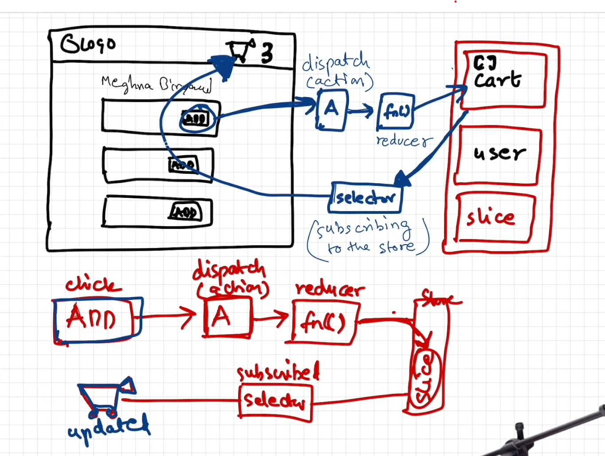

# FusionBowl - A Modern React Food Delivery App

Welcome to **FusionBowl**, a feature-rich food delivery application built with React. This project demonstrates a comprehensive understanding of modern frontend development, showcasing advanced concepts like state management with Redux Toolkit, performance optimization, and a responsive user interface.

## Table of Contents

1. [Project Overview](#project-overview)
2. [Key Features](#key-features)
3. [Technologies Used](#technologies-used)
4. [Architecture and Design](#architecture-and-design)
5. [Getting Started](#getting-started)
6. [Available Scripts](#available-scripts)
7. [Project Structure](#project-structure)
8. [Future Enhancements](#future-enhancements)

## Project Overview

FusionBowl is a single-page application (SPA) that emulates a food ordering platform like Swiggy or Zomato. It allows users to browse restaurants, view menus, add items to their cart, and manage their orders. The application is designed with a focus on clean code, scalability, and performance.

## Key Features

- **Dynamic Restaurant Listing**: Fetches and displays a list of restaurants from a live API.
- **Search and Filter**: Users can search for restaurants by name and filter them based on ratings.
- **Restaurant Menu**: Detailed menu page for each restaurant, with categorized item listings.
- **State Management with Redux Toolkit**: Centralized state management for the shopping cart, including adding, removing, and clearing items.
- **Accordion-style Menu**: Menu categories are displayed in an accordion-style, allowing users to expand and collapse sections.
- **Lazy Loading**: Components like `Grocery`, `About`, and `Cart` are lazy-loaded to improve initial load time.
- **Shimmer UI**: A shimmer effect is displayed while fetching data to enhance user experience.
- **Higher-Order Components (HOCs)**: Used to add promotional labels to restaurant cards.
- **Custom Hooks**:
  - `useFetchRestaurant`: Fetches restaurant data.
  - `useFetchRestaurantMenu`: Fetches restaurant menu data.
  - `useInternetStatus`: Checks for online/offline status.
- **Context API**: Manages user-related data, such as login information.
- **Responsive Design**: The UI is designed to be responsive and works well on different screen sizes.

## Technologies Used

- **React**: Core library for building the user interface.
- **React Router**: For client-side routing and navigation.
- **Redux Toolkit**: For efficient and predictable state management.
- **Parcel**: For bundling and development server with HMR.
- **Tailwind CSS**: For utility-first styling.
- **Jest**: For testing (setup is in place).

## Architecture and Design

- **Component-Based Architecture**: The application is built using a modular, component-based architecture, promoting reusability and maintainability.
- **Separation of Concerns**: The code is well-organized, with a clear separation between UI components, state management logic, and utility functions.
- **Single Responsibility Principle**: Each component and function has a single, well-defined responsibility.
- **Custom Hooks for Reusability**: Custom hooks are used to encapsulate and reuse stateful logic.

## Getting Started

To get a local copy up and running, follow these simple steps.

### Prerequisites

- Node.js and npm installed on your machine.

### Installation

1. Clone the repo
   ```sh
   git clone https://github.com/your-username/FusionBowl.git
   ```
2. Navigate to the project directory
   ```sh
   cd FusionBowl
   ```
3. Install NPM packages
   ```sh
   npm install
   ```

## Available Scripts

In the project directory, you can run:

- `npm start`: Runs the app in the development mode. Open [http://localhost:1234](http://localhost:1234) to view it in the browser.
- `npm run build`: Builds the app for production to the `dist` folder.
- `npm test`: Launches the test runner in the interactive watch mode.

## Project Structure

```
FusionBowl/
├── .gitignore
├── .postcssrc
├── index.css
├── index.html
├── package.json
├── README.md
└── src/
    ├── App.js
    ├── Components/
    │   ├── About.js
    │   ├── Body.js
    │   ├── Cart.js
    │   ├── Contact.js
    │   ├── Error.js
    │   ├── Grocery.js
    │   ├── Header.js
    │   ├── ItemList.js
    │   ├── RestaurantCard.js
    │   ├── RestaurantCategory.js
    │   ├── RestaurantMenu.js
    │   ├── Shimmer.js
    │   ├── User.js
    │   ├── UserCard.js
    │   └── UserClass.js
    └── utils/
        ├── appStore.js
        ├── cartSlice.js
        ├── constants.js
        ├── UserContext.js
        ├── useFetchRestaurant.js
        ├── useFetchRestaurantMenu.js
        └── useInternetStatus.js
```

## Future Enhancements

- **User Authentication**: Implement user login and registration.
- **Order Placement**: Add functionality to place orders.
- **Payment Gateway Integration**: Integrate a payment gateway to complete the order flow.
- **Improved Testing**: Add more comprehensive tests for components and Redux logic.
- **Backend API**: Develop a dedicated backend API for more robust data management.

# Namaste React 🚀

## Parcel

    -> Zero Config - just install it and start using it (no need to do any configuration for it)
    -> created Development build of our app
    -> created a server with port no: 1234
    -> hosted our development build on to the server i.e. localhost:1234
    -> It does HMR (Hot Module Replacement) in all the files in our project
        - Parcel is using HMR means whenever, whatever and whereever we make any changes and as soon as we save that file it builts it once again and hosts the new development build on to the server (localhost:1234).
    -> Parcel does HMR because it is monitoring (keeping an eye) all the files and for that it uses 'File Watching Algorithm' which is written in C++
    -> parcel is taking so less time in building those updated development builds because it is also doing caching in '.parcel-cache' to give us faster development experience
    -> Image Optimization
    -> Minification - Instead of development build if we do production build parcel will also do minification of our files as well.
    -> Bundling of our files
    -> It compresses our files also..
    -> Consistent Hashing
    -> Code Splitting
    -> Differential Bundling - Our app can open in Internet Explorer (newer & older), Chrome, Mobile Browser, FireFox etc ... Parcel takes care of all that and gives differential bundling to our app so that our apps runs on both older & newer versions of the browsers .... basically it gives us ability to have different bundles for different types of older browsers.
    -> Diagnostic - If you make an error in your code and configuration , Parcel displays beautiful diagnostics in your terminal and in the browser.
    -> currently our app is hosted on http but it gives us the ability to run our app on https as well (if we want to check any feature of our app is running on the https as well or not)
    -> Tree Shaking - Parcel statically analyzes the imports and exports of each module, and removes everythjing that isn't used.
    -> Parcel creates different development build and production build bundles (because production build takes a little more time than develoment builds because some optimizations are more in production build than than deveelopment build)

## Accessing one component inside another component

-> We can do like putting the component name in other component like -- <Componentname/>
but we can also do it like -- <Componentname></Componentname>
because <Componentname/> is the short hand way (shortcut) of <Componentname></Componentname> , so they both are same.

## Two types of Export & Import

    -> Default Export/Import
        export default Component/variable;
        import Component/variable from "path";

    -> Named Export/Import
        export const Component/variable;
        import {Component/variable} from "path";

## React Hooks

-> Normal JS utility functions
-> Two important and commonly used hooks are-
-> useState() : used to create State variables in React.
-> usseEffect() :

-> State Variable keeps the UI in sync with the data layer (whatever the data will be, it will be rendered on the UI but if the Data layer changes UI will also get re-rendered based the changed data layer)

## How the state variable declared using const can be changed using the setState()?

    => The value of a state variable declared using const can be changed because React internally manages the state. The const declaration means the reference to the variable name (count, name, etc.) doesn’t change — not the value itself.

        When setState() is called, React updates the internal state value and then re-renders the component. During this re-render, React calls the function component again, and the state variable (const) now refers to the updated value.

            So, even though we use const, the value appears to change because React provides a new value in the next render, not by replacing the variable, but by re-invoking the function with updated internal state.


                                                    OR


    => The value of a state variable declared using const can be changed because React internally manages the state. The const declaration means that the reference to the state variable name (like count, user, etc.) doesn’t change — but the value it holds can during re-renders.

        When setState() is called:

            - "React updates the internal state value."

            - "React then triggers a re-render of the component."

            - "During the re-render, React calls the function component again, and the const state variable now refers to the updated value."

            Behind the scenes, React uses a virtual DOM diffing algorithm to detect which parts of the UI have changed.

            - "It doesn't re-render the entire DOM."

            - "It only updates the parts that are different, making it highly efficient."

            - "So although the component function is re-executed, React intelligently updates only the affected DOM elements based on the updated state."

    In short, even though we use const, it works because React provides a new value during each re-render, and ensures that only the necessary parts of the UI are updated, not the whole page.

## 2 types of routing in web app

    1) Client Side Routing - Here we don't make any network calls (while navigating b/w pages) for pages (like index.html,about.html,etc) or any kind of Components instead at the initial render/loading of the web page (in-case of React) all the components gets loaded they just re-render o0r replace the other components while we navigate b/w pages.

    2) Server Side Routing - Here to navgate b/w pages we need to make network call to the server for those pages we are navigating to  from the server like index.html,about.html, etc.

## React Lifecycle Methods Diagram

-> https://projects.wojtekmaj.pl/react-lifecycle-methods-diagram/


## Advantages & Dusadvantages of Tailwind CSS

### ✅ Advantages of Tailwind CSS

    **1. Utility-First Approach**
    Tailwind uses utility classes like p-4, m-2, text-center, etc., which makes styling fast, consistent, and predictable.

    **2. Lightweight and Optimized**
    Tailwind is highly optimized during the build process using PurgeCSS, which removes all unused classes.
    🔹 Example: Even if you use a class like m-4 or p-4 a thousand times across your project, it is included only once in the final CSS bundle, keeping the file size minimal.

    **3. Tiny Final CSS Bundle**
    Tailwind ensures that you never ship unused CSS again.
    In traditional CSS, developers might unknowingly redefine styles already defined elsewhere, leading to duplicate and unused styles bloating the final bundle.
    👉 But with Tailwind, since styles are applied via utility classes directly in the HTML or JSX, only the used classes are compiled into the final output, keeping things clean and tiny.

    **4. No Worries About Duplication**
    Since you apply styles as you build components, there's no need to worry about repeating or duplicating CSS declarations. Tailwind avoids bloated or repetitive styling patterns.

    **5. Faster Development – "Styling on the Fly"**
    You can add styles while building components, without writing custom CSS. This allows faster prototyping and development.
    ➕ You don’t have to jump between your HTML and CSS files—everything happens in one place.

    **6. Highly Customizable**
    Tailwind can be extended or configured using the tailwind.config.js file, giving you complete control over design tokens like colors, fonts, spacing, etc.

    **7. Great Developer Experience**
    Autocomplete support in modern editors (via extensions) makes using utility classes even easier. You also benefit from a consistent design system.

### ❌ Disadvantages of Tailwind CSS

    **1. Initial Learning Curve**
    Developers new to utility-first CSS might find it unfamiliar or messy at first, especially with so many class names in HTML.

    **2. Verbose HTML Markup**
    Utility classes are added directly in the markup, which can make the HTML/JSX look long or cluttered (e.g., <div class="p-4 bg-blue-500 text-white text-center rounded-lg">).

    **3. No Separation of Concerns**
    Some developers prefer separating structure (HTML) from styling (CSS). Tailwind blends them together, which can feel unconventional.

    **4. Requires Build Step**
    Tailwind CSS relies on tools like PostCSS and PurgeCSS for optimizing your bundle, so setting up a build process is necessary.

    **5. Custom Components Still Require Extra Work**
    For complex or highly specific UI components, you may still need to write some custom CSS, which Tailwind doesn’t eliminate entirely.

# React Redux

React Redux is the official React UI bindings layer for Redux. It lets your React components read data from a Redux store, and dispatch actions to the store to update state.

# Redux Toolkit (@reduxjs/toolkit)

## Purpose

    The Redux Toolkit package is intended to be the standard way to write Redux logic. It was originally created to help address three common concerns about Redux:

    i) "Configuring a Redux store is too complicated"
    ii) "I have to add a lot of packages to get Redux to do anything useful"
    iii) "Redux requires too much boilerplate code"

# Redux-work-flow



# Immer

->Immer (German for: always) is a tiny package that allows you to work with immutable state in a more convenient way.

# Redux Toolkit uses Immer internally.

->Redux Toolkit automatically uses Immer under the hood, allowing you to write "mutative-looking" logic in reducers while actually applying immutable state updates.
This greatly simplifies reducer implementations, especially for deeply nested state structures, by removing the need for manual copying and spreading.

# 🧠 When Should You Use Redux?

-> You should consider using Redux (especially Redux Toolkit) when:

✅ 1. Your application grows large and complex

> > As your app scales, managing data between many components becomes difficult.

> > Passing props through many layers (prop drilling) becomes messy and hard to maintain.

✅ 2. You need a central place to manage global state

> > Redux acts as a single source of truth, so multiple components can subscribe to and share state reliably.

> > It's helpful when many components are subscribed to many slices, and you want to avoid inconsistent states.

✅ 3. You want predictable state management

> > Redux enforces pure functions (reducers) for state changes.

> > State is mutated only in one place, reducing bugs caused by state updates from unexpected components.

✅ 4. You need better debugging and time-travel debugging

> > With Redux DevTools, you can track, inspect, and replay state changes, which is very useful in large applications.

# 🚫 When NOT to use Redux:

> > If your app is small or medium with minimal shared state, Context API + useState/useReducer might be simpler and more appropriate.

> > Avoid adding Redux just for the sake of using it — prefer it when state complexity becomes hard to handle manually.

# 🔁 How Asynchronous Logic Evolved in Redux

## 🔸 Before Redux Toolkit (Classic Redux)

In older versions of Redux:

- Redux did not support async logic out of the box.
- To handle API calls or other side effects, we had to use middleware like:
  - `redux-thunk`
  - `redux-saga`
  - `redux-observable`

**For example:**

- You'd dispatch a thunk function, which would make an API call, and then dispatch another action to update the store.

This approach required a lot of boilerplate:

- Action creators
- Constants for action types
- Reducers
- Middleware setup

---

## ✅ Now with Redux Toolkit (RTK)

Redux Toolkit (RTK) simplifies everything with built-in tools and conventions — and **RTK Query** is a major part of that.

---

### 🚀 RTK Query

A powerful **data fetching and caching** library built into Redux Toolkit.

It handles:

- API calls
- Loading & error states
- Caching
- Auto re-fetching
- Data normalization

> 🎉 **No need for redux-thunk or writing reducers manually** for API data anymore.

---

### ✅ Benefits of RTK Query

- Less boilerplate (just define endpoints).
- Auto-generated hooks for fetching/mutating data.
- Built-in caching and invalidation.
- Better separation of concerns (UI and data logic are cleanly separated).

---

### 📌 Summary

| Old Redux (Pre-RTK)               | Redux Toolkit (Modern)                                          |
| --------------------------------- | --------------------------------------------------------------- |
| Needs `redux-thunk`, `saga`, etc. | Built-in async support via `createAsyncThunk` and **RTK Query** |
| Manual action creators & reducers | Minimal code with powerful tools                                |
| More boilerplate                  | Cleaner and faster development                                  |
| Harder to manage large apps       | Scales well with complex apps                                   |

# A query language for your API

->> GraphQL is a query language for APIs and a runtime for fulfilling those queries with your existing data. GraphQL provides a complete and understandable description of the data in your API, gives clients the power to ask for exactly what they need and nothing more, makes it easier to evolve APIs over time, and enables powerful developer tools.
